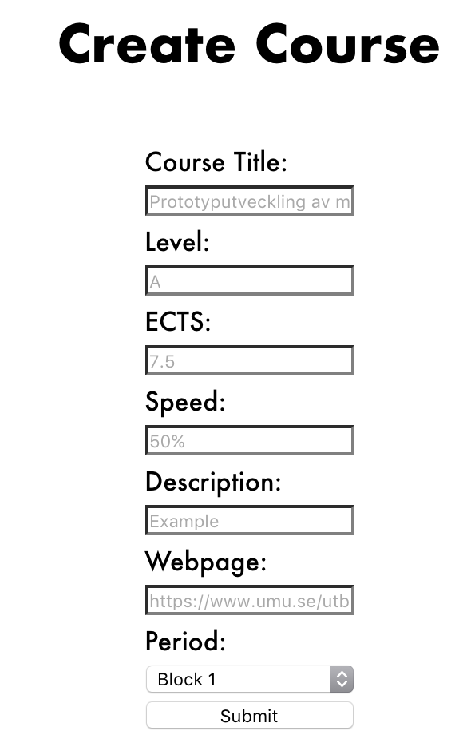
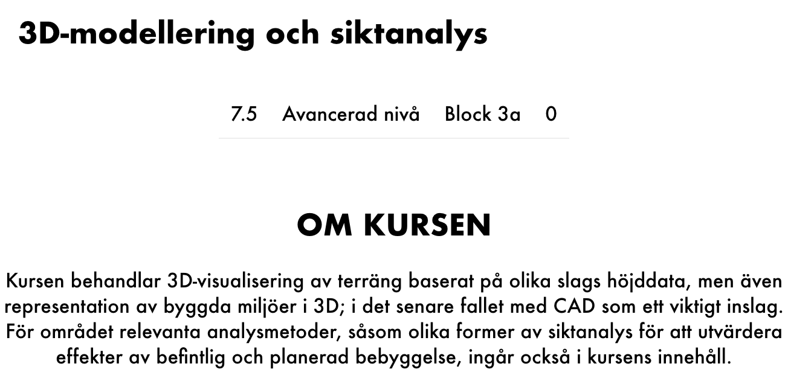

% Project Report
% Marc Coquand, Viyan Ateaa and Isak Lundberg
% 14/03-17

# Introduction

This project is a part of the course database tech and web based systems. The
task is to develop a web based application. In this case this will be done in a
group of 3. The program has to in some way do the following:

* Implement CRUD-functionality
* Implement a login
* Store information 
* The web page has to present data from the database
* Implement an input field 
* The auto generated code needs to be in coherence with W3C recommendations

# Project description

At the Interaction and design programme there's a lot of freedom to pick and chose
what type of courses you want to study. Some of them are good and some of them
might seem interesting but turn out not to be so good. That's why there's a need
for a program where you can rate the courses relevant to the programme. 

The goal of this project is to create a web application where users can view,
create, edit, review course information. The idea is that the webpage should be
self maintaining to avoid having the need for a moderator. With that said there
needs to be an admin that should be able to remove posts.

When reviewing a webpage, user's should be able to write their thoughts about
the course in a short format. They should also be able to recommend or not
recommend the course in form of thumbs up or thumbs down. These reviews should
be visible to other users.

When creating course information, the user should be able to write a short
description about the course as link to the main site for course description.

## ER-diagram

## Flow chart of the GUI

\newpage

# Compilation and usage

To compile the system you require to download and install meteor.[^1]
Afterwards to compile and run the program you change directory to the project
folder and then run the command 'meteor'.

[^1]: http://meteor.com/

# Result and System Description

The result of the project is a web based system capable of having users, admins,
courses and comment sections. Each user has the ability to view, rate and
comment courses whereas admin is capable of also editing, creating and removing
courses and comments.

A course is a database containing a title, study speed, the amount of ects
points it yields, url to the main info page, which block during the study year
it starts and a description. This database is then linked to a comment database
containing the user ID of the poster as well as the comment content.

## Adding a course

The admin has the ability to add courses, when doing so, the course info the
admin submits is validated both on the front end and the back end. The admin can
later also edit this course.

## Viewing courses

When entering the webpage, the user is greeted by the main course overview where
the user can see the courses and also what score each course
has. The way the score system work is that each user can either upvote or
downvote a course, meaning it gives it a point or removes a point from the
course's score. The user can only give each course one point or remove one point
respectively. The user also has the ability to search for specific courses using
the search bar.

# Division of labor

Everyone in the team are flexible in what they're working in. With that said
everyone has a key responsibility of making sure certain things happen. Marc is
the project leader and responsible for scheduling, turning in documents and
making sure the dynamic in the team is good. Viyan is responsible for the design
and has the final say in all design decisions. Isak is responsible for the back
end.
